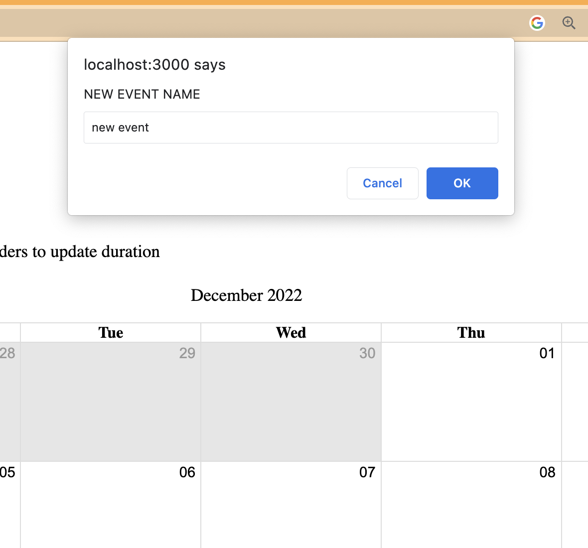
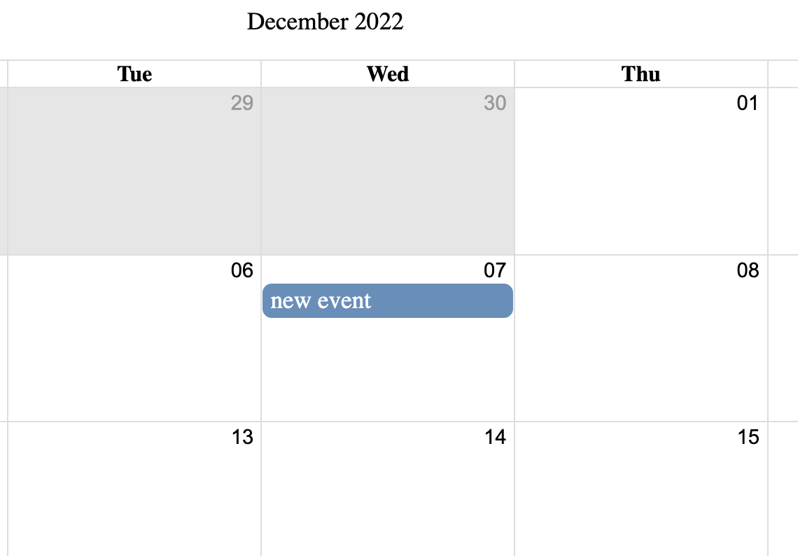
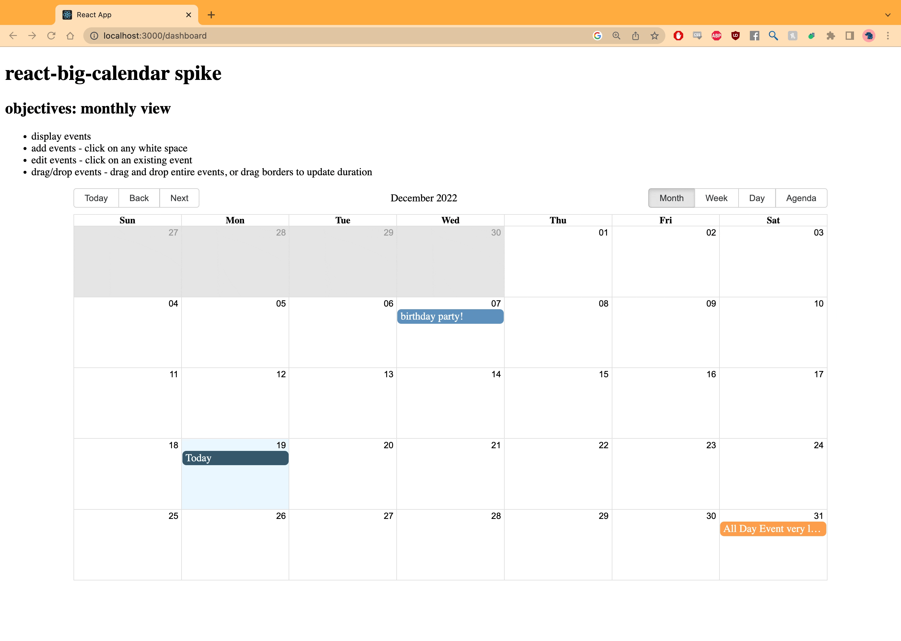

# Spike for react-big-calendar

## Background
In preparation for my project Gig Tree, I delved into the library `react-big-calendar`. Gig Tree is a project scheduling and management application, and I was looking for a library that can handle displaying, creating, and editing calendar events.

## Functionality
This small example application shows all the basic functionality listed above, as well as the ability to drag, drop, and resize events thanks to the drag-and-drop addon. 

Each event is stored as an object. For the purposes of this spike, I created sample objects in `src/events.js` and imported them into `index.js` as the initial state for the redux store.

### add event
To add an event, click any white space and enter the event name in the window alert. In these simple iterations, the new events have default start and end times of midnight, but these can be easily specified.

### edit event
Edit the name of the event by clicking it. It will be fairly easy to extrapolate this to editing any number of event properties.

### drag and drop event
Thanks to the drag and drop add-on, users can adjust start and end dates with intuitive drag and drop actions.

